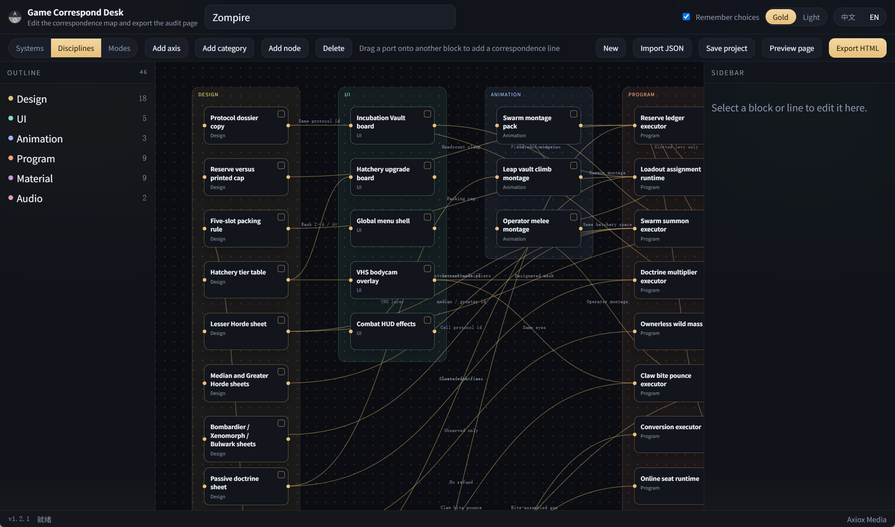

# 游戏照应台

**Packed via Axiox Media**

本地编辑器：布置系统 / 工种双轴照应图，并导出开发团队可直接打开的单机查阅 HTML。

  

  

> [!NOTE]
> 打包出的 EXE 未签名，Windows Defender 可能在首次运行时提示。可用 `start.bat` 直接跑源码。

## 功能

- 左侧维护系统树与工种树
- 画布上布置照应块，并为两套视图各存一套坐标
- 节点之间拉运行时照应线
- 保存项目 JSON
- 导出独立查阅页：勾选、侧栏说明、双轴切换、本地保存完成度

## 安装

优先使用 [GitHub Deploy Desk](https://github.com/axioxmedia/github-deployer) 拉取仓库。本地则双击 `build_exe.bat`，结果在 `dist\GameCorrespondDesk.exe`。

截图请放到本目录的 `APPCap.png`。
